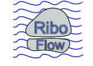
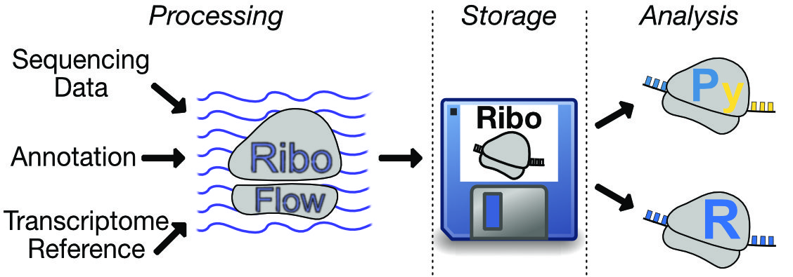

[](https://doi.org/10.5281/zenodo.3376949)



# RiboFlow

RiboFlow is a [Nextflow](https://www.nextflow.io/) based pipeline for processing ribosome profiling data. As output, it generates [ribo files](https://ribopy.readthedocs.io/en/latest/ribo_file_format.html) that can be analyzed using [RiboR](https://github.com/ribosomeprofiling/ribor) or [RiboPy](https://github.com/ribosomeprofiling/ribopy). RiboFlow belongs to a [software ecosystem](https://ribosomeprofiling.github.io/) designed to work with ribosome profiling data.



## What it does

Three independent, composable paths (any combination can be enabled):

| Path | Gate | Output |
|---|---|---|
| **Genome alignment** (STAR) | `genome.run: true` (default) | dedup BAM/BED, strand-specific bigWigs, alignment stats |
| **Transcriptome** (bowtie2) | `transcriptome.run: true` | per-sample `.ribo` + merged `all.ribo` |
| **RNA-seq** (parallel genome + transcriptome) | `do_rnaseq: true` | RNA-seq BAM/BED/bigWigs/stats; RNA-seq embedded into `.ribo` when the transcriptome path is on |

Deduplication is selectable per path: `umicollapse` (UMI-aware), `position`
(coordinate-only), or `none`.

## Quickstart

**1. Install Miniconda** (skip if you already have `conda`). Miniconda is a small
installer for the conda package manager. Download and install it from
<https://docs.conda.io/en/latest/miniconda.html>, then open a new terminal.

**2. Download the pipeline.**

```bash
git clone https://github.com/DanielNguyener/riboflow_genome.git
cd riboflow_genome
```

**3. Create the environment (this also installs Nextflow).** This one command
builds a environment named `ribo_genome`

```bash
conda env create -f environment.yaml
conda activate ribo_genome
```

**4. Get the reference files and example data.** Clone both into the pipeline
folder you're already in (run from inside `riboflow_genome/`). The first
holds the rRNA filter, transcriptome, annotation and sample fastqs. The second holds an genome index of chrM.

```bash
git clone https://github.com/ribosomeprofiling/references_for_riboflow.git
git clone https://github.com/DanielNguyener/rf_sample_data_genome.git
```

**5. Run the example.**

```bash
nextflow run main.nf -profile local -params-file example_position_multi.yaml
```

`-profile local` tells Nextflow to use certain resource limits. `-params-file` points at
the example configuration. The `-params-file` `-profile` flags are required.

**6. Look at the results.** The example writes everything under
`position_output/`:

- `position_output/stats/genome/stats.csv` — alignment summary, one column per sample
- `position_output/alignments/` — deduplicated BAM/BED files
- `position_output/ribo/all.ribo` — the merged `.ribo` file (this example has the
  transcriptome path on)

See the [Output](#output) section for the full directory tree.

> **macOS users:** real alignments fail natively (STAR's gzip handling) — run inside the Docker image instead; see [Profiles](#profiles).

Everything below covers customizing this for your own data — profiles,
references, dedup, embedded metadata, RNA-seq, and advanced options.

## Contents

- [Quickstart](#quickstart)
- [Requirements](#requirements)
- [Profiles](#profiles)
- [Quick wiring check (stub run)](#quick-wiring-check-stub-run)
- [Running on your data](#running-on-your-data)
- [Running on an HPC cluster (Apptainer or conda)](#running-on-an-hpc-cluster-apptainer-or-conda)
- [Output](#output)
- [Building the STAR genome index](#building-the-star-genome-index)
- [Working with UMIs](#working-with-unique-molecular-identifiers)
- [Transcriptome path and `.ribo` files](#transcriptome-path-and-ribo-files)
- [Embedding metadata into `.ribo` files](#embedding-metadata-into-ribo-files)
- [Pairing ribo-seq with RNA-seq](#pairing-ribo-seq-with-rna-seq)
- [Advanced features](#advanced-features)
- [FAQ](FAQ.md) · [Changelog](CHANGELOG.md)

## Requirements

The [Quickstart](#quickstart) above installs all of this for you via the conda
env; this section is the detail behind it.

- **[Nextflow](https://www.nextflow.io/) ≥ 24** and **Java 17** (DSL2; the old
  Nextflow 19.04.1 / DSL1 requirement no longer applies).
- The bioinformatics tools (STAR, bowtie2, samtools, cutadapt, deeptools, bedtools,
  umicollapse, umi_tools, ribopy, and the `rfc` helper from
  [RFCommands](https://github.com/DanielNguyener/RFCommands_genome)). These are
  provided by the single consolidated conda environment in `environment.yaml`
  (Nextflow-managed) or the published Docker/Apptainer image — see
  [Profiles](#profiles).

> **macOS note:** STAR’s gzip handling fails on macOS. Run real alignments inside the
> Linux Docker/Apptainer image. Stub wiring checks work anywhere.

## Profiles

Profiles are composable — combine an **environment** profile with a **resource** profile
using a comma. Always pass at least one of each (except `-profile local` which bundles
both):

```bash
nextflow run main.nf -profile conda,ls6          # HPC (TACC LS6)
nextflow run main.nf -profile apptainer,ls6      # HPC with Apptainer
nextflow run main.nf -profile conda,local        # Conda on a local machine
nextflow run main.nf -profile docker,local       # Docker on a local machine
nextflow run main.nf -profile local              # ambient env + local machine
```

### Environment profiles

| Profile | What it does |
|---|---|
| `local` | Ambient environment — tools must already be on `PATH` (e.g. an activated `ribo_genome` conda env). Also loads `conf/local.config` (workstation resources). Use as a standalone shorthand. |
| `conda` | Nextflow builds/manages the consolidated conda env from `environment.yaml`. Pair with a resource profile. |
| `apptainer` | Runs every process in `docker://danielnguyener/riboflow:0.0.2`. Pair with a resource profile. |
| `docker` | Runs every process in `danielnguyener/riboflow:0.0.2`. Pair with a resource profile. |
| `test` | Tiny stub fixtures (`conf/test.config`) for wiring checks — no tools needed. |

### Resource profiles

| Profile | Config file | Sized for |
|---|---|---|
| `local` | `conf/local.config` | Workstation / laptop (16 cores, 32 GB RAM) |
| `ls6` | `conf/ls6.config` | TACC LS6 compute node (128 cores, 256 GB RAM) |

Adjust `executor.cpus`, `executor.memory`, and the per-process `cpus`/`memory` values
in the relevant config file to match your machine.


## Running on your data

Four ready-to-edit parameter files are shipped:

| Params file | Ribo dedup | Genome MAPQ mode | Demonstrates |
|---|---|---|---|
| `example_position_multi.yaml` | `position` | unique-only (255) | full pipeline (genome + transcriptome `.ribo` + RNA-seq), position dedup |
| `example_umi_uniq.yaml` | `umicollapse` | unique-only (255) | full pipeline (genome + transcriptome `.ribo` + RNA-seq), UMI dedup |
| `example_transcriptome_only.yaml` | `umicollapse` | n/a (`genome.run: false`) | transcriptome-only `.ribo` (no STAR genome alignment), UMI dedup + RNA-seq via the transcriptome path |
| `example_chrM_build_index.yaml` | `position` | unique-only (255) | **build-from-FASTA mode** — pipeline generates STAR index from chrM FASTA+GTF |

A real run (Nextflow-managed conda env on Linux):

```bash
nextflow run main.nf -profile conda -params-file example_position_multi.yaml
```

…or inside the Docker image (recommended on macOS/Windows):

```bash
docker pull --platform linux/amd64 danielnguyener/riboflow:0.0.2
docker run --platform linux/amd64 --rm -it \
  -u "$(id -u):$(id -g)" -v "$(pwd)":/work -w /work \
  danielnguyener/riboflow:0.0.2 bash
# inside the container:
nextflow run main.nf -profile local -params-file example_position_multi.yaml
```

To adapt to your own data, copy an example file and edit:

1. **References** under `input.reference`:
   - `filter` — bowtie2 rRNA/contaminant index prefix (
     [references_for_riboflow](https://github.com/ribosomeprofiling/references_for_riboflow)
     includes human and mouse).
   - **Genome index — pick one mode** (see [Building the STAR genome index](#building-the-star-genome-index)):
     - *Mode A (pre-built):* `genome: /path/to/star_index_dir`
     - *Mode B (build in pipeline):* `genome_fasta: /path/to/genome.fa` + `gtf: /path/to/annotation.gtf`
   - `transcriptome` / `regions` / `transcript_lengths` — only needed when
     `transcriptome.run: true` (the `.ribo` path).
2. **FASTQs** under `input.fastq.<sample>` — one list per sample; ribo-seq lanes are
   single-end strings.
3. **RNA-seq** (optional) under `rnaseq.fastq.<sample>` with matching sample names;
   each lane is a single-end string or a paired-end `[R1, R2]` list. Set
   `do_rnaseq: false` to skip.
4. **Dedup** — `dedup_method` (ribo) and `rnaseq.dedup_method` (RNA-seq).
5. **Output locations** — `output.output.base` / `output.intermediates.base` (the
   examples use namespaced dirs like `position_output/` so a smoke run doesn’t collide
   with real projects).

`-resume` re-uses cached steps (`storeDir`), so you can iterate on downstream params
without re-aligning.

## Running on an HPC cluster (Apptainer or conda)

On a cluster you can run the pipeline two ways — pick whichever your site
supports; both are equally usable. Each pairs an environment with a **resource
profile**: `local` (workstation sizing, the default) or `ls6` (TACC LS6 sizing).
Tune `conf/ls6.config` to match your node, or add your own resource config and
pass it instead.

### Option A — Apptainer / Singularity (TACC)

Pull the image once, then launch the pipeline from inside an Apptainer shell:

```bash
# one-time
apptainer pull docker://danielnguyener/riboflow:0.0.2

# per run
apptainer shell riboflow_0.0.2.sif
cd /path/to/your_run_dir
nextflow run /path/to/riboflow_genome/main.nf \
    -profile ls6 -params-file /path/to/your_params.yaml
```

Inside the shell the container's tools are on `PATH` and `-profile ls6` (or `local`) supplies the resource limits.

### Option B — conda environment (Linux login/compute node)

If your cluster supports conda, the consolidated `ribo_genome` env is equally
usable and needs no container. Create it once (see the
[Quickstart](#quickstart)), then either activate it yourself…

```bash
conda activate ribo_genome
nextflow run /path/to/riboflow_genome/main.nf \
    -profile ls6 -params-file /path/to/your_params.yaml
```

…or let Nextflow build and manage it per process:

```bash
nextflow run /path/to/riboflow_genome/main.nf \
    -profile conda,ls6 -params-file /path/to/your_params.yaml
```

Either way, swap `ls6` for `local` (or your own resource config) to match the
node you're on.

## Output

The base output and intermediates directories are set in your params file:

```yaml
output:
   individual_lane_directory: 'individual'
   merged_lane_directory: 'merged'
   intermediates:
      base: 'intermediates'   # → $NF_RUN_DIR/intermediates/
   output:
      base: 'output'          # → $NF_RUN_DIR/output/
```

The trees below use `<out>` / `<inter>` for whatever you configure. Exact files depend
on `dedup_method`, `transcriptome.run`, `do_rnaseq`, and `do_strand_split`.

### Output directory (`<out>/`)

#### `dedup_method: "umicollapse"` with `do_rnaseq: true`, `do_strand_split: true`

```
<out>/
├── alignments/
│   ├── ribo/
│   │   ├── individual/
│   │   │   ├── <sample>.<lane>.genome.qpass.bed
│   │   │   ├── <sample>.<lane>.genome.post_dedup.bed
│   │   │   ├── <sample>.<lane>.post_dedup.bam
│   │   │   └── <sample>.<lane>.post_dedup.bam.bai
│   │   ├── merged/
│   │   │   ├── <sample>.dedup.bam
│   │   │   ├── <sample>.dedup.bam.bai
│   │   │   ├── <sample>.genome.post_dedup.bed
│   │   │   ├── <sample>.genome.qpass.merged.bam
│   │   │   └── <sample>.genome.qpass.merged.bam.bai
│   │   └── stranded/                            # only if do_strand_split: true
│   │       ├── <sample>.ribo.plus.bam(.bai)
│   │       ├── <sample>.ribo.plus.bed
│   │       ├── <sample>.ribo.minus.bam(.bai)
│   │       └── <sample>.ribo.minus.bed
│   └── rnaseq/                                  # only if do_rnaseq: true
│       ├── individual/
│       │   └── <sample>.<lane>.rnaseq_genome.qpass.bed
│       └── merged/
│           ├── <sample>.rnaseq_genome.qpass.bed
│           ├── <sample>.rnaseq_genome.qpass.merged.bam
│           └── <sample>.rnaseq_genome.qpass.merged.bam.bai
├── bigwigs/
│   ├── ribo/
│   │   ├── <sample>.ribo.plus.bigWig
│   │   └── <sample>.ribo.minus.bigWig
│   └── rnaseq/                                  # only if do_rnaseq: true
│       └── <sample>.rnaseq.bigWig
├── ribo/                                        # only if transcriptome.run: true
│   ├── <sample>.ribo
│   └── all.ribo                                 # merged across samples
├── rnaseq/                                      # only if do_rnaseq: true
│   └── stats/
│       ├── rnaseq_stats.csv
│       └── rnaseq_individual_stats.csv
└── stats/
    ├── genome/{stats.csv, individual_stats.csv}
    ├── transcriptome/                           # only if transcriptome.run: true
    │   ├── transcriptome_stats.csv
    │   └── transcriptome_individual_stats.csv
    └── index_fastq_correspondence.txt
```

#### `dedup_method: "position"`

Same shape, except the ribo-seq **individual** directory holds BEDs only (the position
deduplicator works on a merged BED), and the **merged** directory gains both the
post-dedup BAM and BED. Stranded and bigWig outputs are identical.

### Intermediates directory (`<inter>/`)

All intermediates are safe to delete; `storeDir` regenerates them on re-run.

```
<inter>/
├── genome/
│   ├── alignment/        # STAR BAMs + logs, qpass.merged BAMs
│   ├── quality_filter/   # qpass BAMs + qpass.{total,primary,secondary}.count
│   ├── bam_to_bed/       # per-lane qpass BEDs, pre-dedup merged BED
│   └── alignment_ribo/   # post-dedup BAM/BED + dedup count files
├── transcriptome/        # only if transcriptome.run: true
│   ├── alignment/        # bowtie2 transcriptome BAMs + logs
│   ├── quality_filter/
│   └── alignment_ribo/   # ribopy-create inputs
├── clip/                 # cutadapt outputs + logs
├── filter/               # bowtie2 rRNA filter BAMs/FASTQs/logs
├── umi_tools/            # only if dedup_method: umicollapse
└── rnaseq/               # only if do_rnaseq: true (genome + transcriptome subtrees)
```

Ribo-seq bigWigs cover read 5′ ends on the genome. RNA-seq bigWigs are unstranded coverage.

## Building the STAR genome index

There are two ways to provide a STAR genome index. **Pick one per run — do not set both.**

### Mode A — pre-built index (you already have one)

```yaml
input:
  reference:
    genome: /path/to/STAR_GRCh38_index   # directory containing SA, SAindex, Genome, chrNameLength.txt
```

Build it manually with the same STAR version as `environment.yaml` (**STAR ≥ 2.7.10**):

```bash
STAR --runMode genomeGenerate \
  --runThreadN 16 \
  --genomeDir /path/to/STAR_GRCh38_index \
  --genomeFastaFiles /path/to/GRCh38.primary_assembly.genome.fa \
  --sjdbGTFfile /path/to/gencode.v48.annotation.gtf \
  --sjdbOverhang 28
```

### Mode B — let the pipeline build it (build-from-FASTA)

Omit `genome:` and provide the source files instead. The pipeline runs
`STAR --runMode genomeGenerate` as the first step, then feeds the result directly into
alignment:

```yaml
input:
  reference:
    genome_fasta: /path/to/GRCh38.primary_assembly.genome.fa
    gtf:          /path/to/gencode.v48.annotation.gtf

star:
  sjdb_overhang: 28          # read_length - 1; must match your library (see below)
  index_dir: /path/to/cache  # recommended: reuses the built index across runs
  # index_args: ‘’           # extra genomeGenerate flags; ‘--genomeSAindexNbases 7’ for very small genomes only
```

The built index is saved to the `index_dir` you set above (or, if you leave it unset, to a
`star_index` folder under your intermediates directory). Any later run pointing at the same
`index_dir` reuses the saved index and skips the build step. See
`example_chrM_build_index.yaml` for a working example using a chrM-only index.

### `sjdbOverhang` guidance

Set `--sjdbOverhang` to (your longest read length) − 1. Ribo-seq footprints are typically short after trimming (~26–34 nt), so this project defaults to `28`.

## Working with Unique Molecular Identifiers

UMIs are short random barcodes ligated before PCR; reads sharing alignment position
**and** UMI are PCR duplicates. Ribo-seq UMI dedup uses
[umicollapse](https://github.com/Daniel-Liu-c0deb0t/UMICollapse) on the
coordinate-sorted BAM, while UMI *extraction* (peeling the UMI into the read header) is
handled by [umi_tools extract](https://umi-tools.readthedocs.io/). Two params control
the flow:

| Param | Purpose |
|---|---|
| `umi_tools_extract_arguments` | Passed verbatim to `umi_tools extract` — defines where the UMI lives and how much to discard. |
| `umicollapse_arguments` | Extra flags for `umicollapse` on top of the core flags. Usually `""`. |

```yaml
dedup_method: "umicollapse"
# 12 nt UMI at the 5' end, followed by 4 nt of spacer to discard.
umi_tools_extract_arguments: "-p \"^(?P<umi_1>.{12})(?P<discard_1>.{4}).+$\" --extract-method=regex"
umicollapse_arguments: ""
```

`dedup_method` accepts `"umicollapse"`, `"position"` (coordinate-only, RFC `dedup`; use
when reads have no UMI), or `"none"` (skip dedup; bigWigs/BEDs built from the qpass
BAM). UMI dedup is **not** supported on the RNA-seq side — use
`rnaseq.dedup_method: "position"` or `"none"`.

## Transcriptome path and `.ribo` files

Setting `transcriptome.run: true` enables the classic RiboFlow transcriptome path:
reads are aligned with **bowtie2** against a transcriptome index, quality-filtered and
deduplicated, then `ribopy create` produces a per-sample `.ribo` file. All per-sample
`.ribo` files are combined into `all.ribo` (`ribopy merge`). This requires the
`transcriptome`, `regions`, and `transcript_lengths` references plus the `ribo.*`
params (`ref_name`, `metagene_radius`, spans, read-length bounds).

> **Note:** `.ribo` files currently store only **transcriptome-alignment**–derived data.
> Genome-alignment results (the STAR genome path’s BAM/BED, bigWigs, and stats) are **not**
> embedded into `.ribo` files — they remain standalone outputs under `<out>/alignments/`,
> `<out>/bigwigs/`, and `<out>/stats/genome/`.

## Embedding metadata into `.ribo` files

`ribopy create` supports embedding structured YAML metadata directly into each `.ribo`
file. Two independent metadata slots are available:

| Param | Scope | ribopy flag | Purpose |
|---|---|---|---|
| `ribo.ribometa` | Experiment-wide — same YAML for all samples | `--ribometa` | Run configuration, organism, date, operator, etc. |
| `ribo.metadata.files.<sample>` | Per-sample — different YAML per sample | `--expmeta` | Cell line, treatment, batch, GEO accession, etc. |

Both are optional and independent. Per-sample metadata takes precedence over `ribo.expmeta`
(the global expmeta fallback) when both are set for the same sample.

### Embedding the run config as experiment metadata

Passing your params YAML as `ribometa` is the conventional way to record exactly what
settings produced each `.ribo` file:

```yaml
ribo:
  ribometa: ./example_position_multi.yaml   # embeds this file into every .ribo
```

### Per-sample metadata

Create one YAML per sample with any key/value pairs you want to record, then map them
under `ribo.metadata.files`:

```yaml
ribo:
  metadata:
    base: ./meta            # optional path prefix applied to all files below
    files:
      GSM1606107: GSM1606107.yaml
      GSM1606108: GSM1606108.yaml
```

Sample names must exactly match the keys under `input.fastq`. A fully annotated example
is in `meta/` alongside `example_umi_uniq.yaml` — `meta/1cell-2.yaml` records an
untreated K562 sample, `meta/1cell-4.yaml` records a harringtonine-washout replicate,
demonstrating that the two samples carry different condition metadata:

```yaml
# meta/1cell-4.yaml (excerpt)
cell_line: K562
treatment:
  condition: harringtonine_washout
  timepoint_hours: 1
  drug: harringtonine
  drug_concentration_uM: 2.0
```

### Verifying embedded metadata

After a real run, inspect what was embedded with:

```bash
ribopy meta info output/ribo/1cell-2.ribo    # experiment-wide (ribometa)
ribopy meta info output/ribo/1cell-4.ribo    # also shows per-sample expmeta
```

## Pairing ribo-seq with RNA-seq

Set `do_rnaseq: true` and provide RNA-seq FASTQs under `rnaseq.fastq.<sample>` (sample
names must match the ribo-seq names). RNA-seq runs its own clip → bowtie2 filter →
STAR genome (ENCODE defaults) → dedup path, producing BAM/BED/bigWig and a separate
stats CSV. When `transcriptome.run` is also on, the RNA-seq transcriptome BED is merged
into the matching ribo-seq `.ribo` via `ribopy rnaseq set`. Paired-end RNA-seq is
supported (`[R1, R2]` lanes), except **PE + `umicollapse`** (UMI extraction is SE-only;
the pipeline errors up front).

## Advanced features

### STAR transcriptome-projected BAM (`star.output_transcriptome_bam`)

Setting `star.output_transcriptome_bam: true` makes STAR emit a deduplicated BAM in transcriptome coordinates, useful for downstream quantifiers (e.g. Salmon in alignment mode). Defaults to `false`.

### Strand-split BAMs (`do_strand_split`)

`do_strand_split: true` splits the merged, post-dedup ribo-seq BAM into plus/minus strand BAMs under `<out>/alignments/ribo/stranded/`. Defaults to `false`.

## Citing

[RiboFlow, RiboR and RiboPy: an ecosystem for analyzing ribosome profiling data at read
length resolution, H. Ozadam, M. Geng, C. Cenik, *Bioinformatics* 36 (9),
2929-2931](https://academic.oup.com/bioinformatics/article/36/9/2929/5701654)

```bibtex
@article{ozadam2020riboflow,
  title={RiboFlow, RiboR and RiboPy: an ecosystem for analyzing ribosome profiling data at read length resolution},
  author={Ozadam, Hakan and Geng, Michael and Cenik, Can},
  journal={Bioinformatics},
  volume={36},
  number={9},
  pages={2929--2931},
  year={2020},
  publisher={Oxford University Press}
}
```

## [Frequently Asked Questions](FAQ.md) · [Release Notes](CHANGELOG.md)
