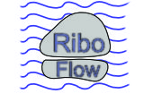
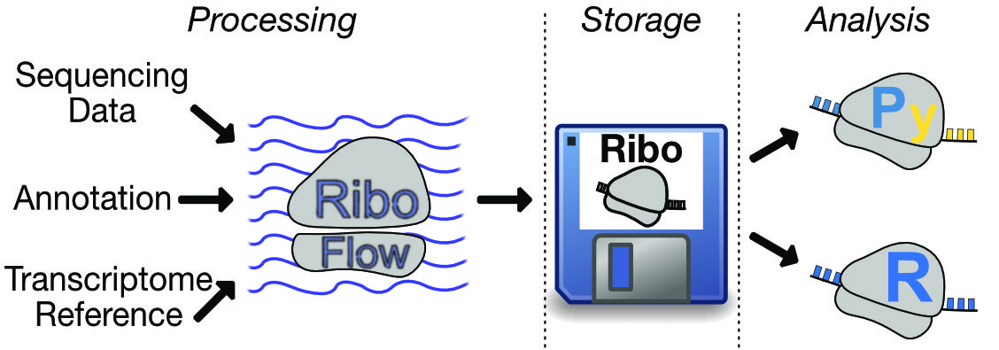

[](https://doi.org/10.5281/zenodo.3376949)



# RiboFlow

RiboFlow is a [Nextflow](https://www.nextflow.io/) based pipeline for processing ribosome profiling data. As output, it generates [ribo files](https://ribopy.readthedocs.io/en/latest/ribo_file_format.html) that can be analyzed using [RiboR](https://github.com/ribosomeprofiling/ribor) or [RiboPy](https://github.com/ribosomeprofiling/ribopy). RiboFlow belongs to a [software ecosystem](https://ribosomeprofiling.github.io/) designed to work with ribosome profiling data.



## What it does

Three independent, composable paths (any combination can be enabled):

| Path | Gate | Output |
|---|---|---|
| **Genome alignment** (STAR) | `genome.run: true` (default) | dedup BAM/BED, alignment stats; strand-specific bigWigs when `do_bigwig: true` |
| **Transcriptome** (bowtie2) | `transcriptome.run: true` | per-sample `.ribo` + merged `all.ribo` |
| **RNA-seq** (parallel genome + transcriptome) | `do_rnaseq: true` | RNA-seq BAM/BED/bigWigs/stats; RNA-seq embedded into `.ribo` when the transcriptome path is on |

Deduplication is selectable per path: `umicollapse` (UMI-aware), `position`
(coordinate-only), or `none`.

## Quickstart

> **Platform.** These instructions assume **Linux (x86-64)**. Several pinned packages
> are Linux-only; on other systems run the pipeline inside the container image (see
> [Profiles](#profiles)).

**1. Install Miniconda** (skip if you already have `conda`). Miniconda is a small
installer for the conda package manager. Download and install it from
<https://docs.conda.io/en/latest/miniconda.html>, then open a new terminal.

**2. Download the pipeline.**

```bash
git clone https://github.com/DanielNguyener/riboflow_genome.git
cd riboflow_genome
```

**3. Create the environment (this also installs Nextflow).** This one command builds an
environment named `ribo_genome`.

```bash
conda env create -f environment.yaml
conda activate ribo_genome
```

**4. Get the reference files and example data.** Clone both into the pipeline
folder you're already in (run from inside `riboflow_genome/`). The first holds the rRNA
filter, transcriptome and annotation references. The second holds the sample FASTQs
(ribo-seq, RNA-seq single- and paired-end) plus a prebuilt STAR genome index and the
FASTA/GTF it was built from.

```bash
git clone https://github.com/ribosomeprofiling/references_for_riboflow.git
git clone https://github.com/DanielNguyener/rf_sample_data_genome.git
```

**5. Run the example.**

```bash
nextflow run main.nf -profile default -params-file example_position_multi.yaml
```

`-profile default` selects the ambient tools (the `ribo_genome` env you just activated)
and workstation resource limits. `-params-file` points at the example configuration.
Both flags are required. The STAR genome index ships prebuilt in the sample data repo at
`rf_sample_data_genome/genome/star_index/`, so there is nothing to build first. (To
rebuild or swap it, see `rf_sample_data_genome/genome/README.md`.)

**6. Look at the results.** The example writes everything under
`position_output/`:

- `position_output/stats/genome/stats.csv` — alignment summary, one column per sample
- `position_output/alignments/` — deduplicated BAM/BED files
- `position_output/ribo/all.ribo` — the merged `.ribo` file (this example has the
  transcriptome path on)

See the [Output](#output) section for the full directory tree.

**7. Try the other examples.** Four more params-files exercise the remaining
capabilities — UMI dedup, transcriptome-only, paired-end RNA-seq, and building the STAR
index from FASTA+GTF. All run against the same data cloned in step 4, the same way as
step 5; see [Running on your data](#running-on-your-data) for what each one covers.

Everything below covers customizing this for your own data — profiles,
references, dedup, embedded metadata, RNA-seq, and advanced options.

## Contents

- [Quickstart](#quickstart)
- [Requirements](#requirements)
- [Profiles](#profiles)
- [Quick wiring check (stub run)](#quick-wiring-check-stub-run)
- [Running on your data](#running-on-your-data)
- [Running on an HPC cluster (Apptainer or conda)](#running-on-an-hpc-cluster-apptainer-or-conda)
- [Output](#output)
- [Building the STAR genome index](#building-the-star-genome-index)
- [Deduplication](#deduplication)
- [Transcriptome path and `.ribo` files](#transcriptome-path-and-ribo-files)
- [Embedding metadata into `.ribo` files](#embedding-metadata-into-ribo-files)
- [Pairing ribo-seq with RNA-seq](#pairing-ribo-seq-with-rna-seq)
- [Optional features](#optional-features)
- [FAQ](FAQ.md) · [Changelog](CHANGELOG.md)

## Requirements

The [Quickstart](#quickstart) above installs all of this for you via the conda
env; this section is the detail behind it.

- **[Nextflow](https://www.nextflow.io/) ≥ 24** and **Java 17** (DSL2; the old
  Nextflow 19.04.1 / DSL1 requirement no longer applies).
- The bioinformatics tools (STAR, bowtie2, samtools, cutadapt, deeptools, bedtools,
  umicollapse, umi_tools, ribopy, and the `rfc` helper from
  [RFCommands](https://github.com/DanielNguyener/RFCommands_genome)). These are
  provided by the single consolidated conda environment in `environment.yaml`
  (Nextflow-managed) or the published Docker/Apptainer image — see
  [Profiles](#profiles).

> **Platform note:** the conda environment is Linux-only — several pinned packages
> don't build elsewhere. On other systems, run the pipeline inside the
> Docker/Apptainer image; see [Profiles](#profiles).

## Profiles

There are two independent axes: **where the tools come from** (environment profile) and
**how big the machine is** (resource profile). Combine one of each with a comma:

```bash
nextflow run main.nf -profile conda,lonestar6      # HPC (TACC Lonestar6)
nextflow run main.nf -profile apptainer,lonestar6  # HPC with Apptainer
nextflow run main.nf -profile conda,default        # Conda on a local machine
nextflow run main.nf -profile docker,default       # Docker on a local machine
nextflow run main.nf -profile default              # ambient env + local machine
```

If you name no resource profile, `default` is applied automatically, so `-profile conda`
alone and a bare `nextflow run` are still correctly sized.

### Environment profiles

These set container/conda options only — never resources — so they compose with any
resource profile.

| Profile | What it does |
|---|---|
| *(omit)* | Ambient environment — tools must already be on `PATH` (e.g. an activated `ribo_genome` conda env). |
| `conda` | Nextflow builds/manages the consolidated conda env from `environment.yaml`. |
| `apptainer` | Runs every process in `docker://danielnguyener/riboflow:0.0.2`. |
| `docker` | Runs every process in `danielnguyener/riboflow:0.0.2`. |

### Resource profiles

| Profile | Config file | Sized for |
|---|---|---|
| `default` | `conf/default.config` | Workstation / laptop / small server (16 cores, 64 GB RAM) |
| `lonestar6` | `conf/lonestar6.config` | Full TACC Lonestar6 compute node (128 cores, 256 GB RAM) |
| `test` | `conf/test.config` | Tiny stub fixtures for `-stub-run` wiring checks — no tools needed |

To fit a different machine, edit `executor.cpus` / `executor.memory` and the per-process
values in the relevant config file. Each file documents its own sizing rules inline.

> **Renamed profiles.** The former `local`, `ambient` and `ls6` profiles have been removed.
> Use `default` in place of `local` or `ambient`, and `lonestar6` in place of `ls6`.


## Quick wiring check (stub run)

A stub run walks the entire workflow graph — every process is replaced by its `stub:`
block, which emits empty placeholder files instead of calling the real tool. It confirms
that channels, parameters and process wiring are correct **without installing STAR,
bowtie2 or anything else**, and finishes in seconds.

```bash
nextflow run main.nf -stub-run -profile test
```

The `test` profile (`conf/test.config`) points at the tiny fixtures in `tests/stub/`
— they ship with the pipeline, so no data cloning is needed. Outputs land under
`tests/stub/work_output/`; the files are empty by design.

Override any parameter on the command line to check a different branch:

```bash
nextflow run main.nf -stub-run -profile test --dedup_method umicollapse
nextflow run main.nf -stub-run -profile test --genome.run false --transcriptome.run true
nextflow run main.nf -stub-run -profile test --do_rnaseq true --transcriptome.run true
```

### Automated test suite (nf-test)

The same stub matrix is codified as [nf-test](https://www.nf-test.com/) cases, plus
per-module tests. Install nf-test (not part of `environment.yaml`), then run the whole
suite from the repo root:

```bash
conda install -c bioconda nf-test     # or: curl -fsSL https://get.nf-test.com | bash
nf-test test
```

| Path | Covers |
|---|---|
| `tests/pipeline/main.nf.test` | 13 whole-DAG stub runs: all three dedup methods, genome-only / transcriptome-only / both, single- and paired-end RNA-seq, build-from-FASTA index generation, and the two rejected PE combinations (asserting the expected error messages) |
| `tests/modules/*.nf.test` | Individual modules — `RIBOPY_MERGE`, `SAMTOOLS_QPASS` |

`nf-test.config` sets `profile "test"` for every case, so all of them use the stub
fixtures and need no tools installed. Run a single file with
`nf-test test tests/pipeline/main.nf.test`.

Stub runs verify wiring only — they cannot catch numerical or alignment errors. Use the
[Quickstart](#quickstart) example for an end-to-end check with real tools.


## Running on your data

Five ready-to-edit parameter files are shipped. Between them they exercise every
capability in the [What it does](#what-it-does) table; all run against the data cloned
in Quickstart step 4.

| Params file | Ribo dedup | Genome MAPQ mode | Demonstrates |
|---|---|---|---|
| `example_position_multi.yaml` | `position` | unique-only (255) | full pipeline (genome + transcriptome `.ribo` + RNA-seq), position dedup, multi-lane merging |
| `example_umi_uniq.yaml` | `umicollapse` | unique-only (255) | full pipeline (genome + transcriptome `.ribo` + RNA-seq), UMI dedup |
| `example_transcriptome_only.yaml` | `umicollapse` | n/a (`genome.run: false`) | transcriptome-only `.ribo` (no STAR genome alignment), UMI dedup + RNA-seq via the transcriptome path |
| `example_build_index.yaml` | `umicollapse` | unique-only (255) | **build-from-FASTA mode** — the only example that runs `genomeGenerate`; ribo-seq + RNA-seq + transcriptome — see the note below |
| `example_rnaseq_pe.yaml` | `none` (passenger) | multimappers (0 / flags 2052) | **paired-end RNA-seq** genome alignment with `umicollapse` dedup — see the note below |

Every example that aligns to the genome reads one path —
`./rf_sample_data_genome/genome/star_index` — which ships prebuilt.
`example_build_index.yaml` is the only one that regenerates it.

> **Reference note.** Nothing in these params files names a chromosome. The shipped index
> is a small example reference, sized to fit in a normal GitHub repository, and the FASTQs
> the examples use are matched to it so the `.ribo` output is not degenerate. It exercises
> every code path but is not a substitute for a real genome — point
> `input.reference.genome` at your own index for real work. See the
> [rf_sample_data_genome](https://github.com/DanielNguyener/rf_sample_data_genome)
> repository for what it contains and how it is built.

> **Paired-end note.** PE RNA-seq is **genome-only** — PE through the transcriptome path
> is rejected at startup, as is `rnaseq.dedup_method: position`. Use `umicollapse` or
> `none`. The PE example's data (SRR1039508, GSE52778) has no UMIs, so it declares a
> pseudo-UMI purely to exercise the dedup branch; its duplicate counts are not
> biologically meaningful. Replace the `bc-pattern` with your real layout.

A real run (Nextflow-managed conda env on Linux):

```bash
nextflow run main.nf -profile conda,default -params-file example_position_multi.yaml
```

…or inside the Docker image:

```bash
docker pull --platform linux/amd64 danielnguyener/riboflow:0.0.2
docker run --platform linux/amd64 --rm -it \
  -u "$(id -u):$(id -g)" -v "$(pwd)":/work -w /work \
  danielnguyener/riboflow:0.0.2 bash
# inside the container:
nextflow run main.nf -profile default -params-file example_position_multi.yaml
```

To adapt to your own data, copy an example file and edit:

1. **References** under `input.reference`:
   - `filter` — bowtie2 rRNA/contaminant index prefix (
     [references_for_riboflow](https://github.com/ribosomeprofiling/references_for_riboflow)
     includes human and mouse).
   - **Genome index — pick one mode** (see [Building the STAR genome index](#building-the-star-genome-index)):
     - *Mode A (pre-built):* `genome: /path/to/star_index_dir`
     - *Mode B (build in pipeline):* `genome_fasta: /path/to/genome.fa` + `gtf: /path/to/annotation.gtf`
   - `transcriptome` / `regions` / `transcript_lengths` — only needed when
     `transcriptome.run: true` (the `.ribo` path).
2. **FASTQs** under `input.fastq.<sample>` — one list per sample; ribo-seq lanes are
   single-end strings.
3. **RNA-seq** (optional) under `rnaseq.fastq.<sample>` with matching sample names;
   each lane is a single-end string or a paired-end `[R1, R2]` list. Set
   `do_rnaseq: false` to skip.
4. **Dedup** — `dedup_method` (ribo) and `rnaseq.dedup_method` (RNA-seq).
5. **Output locations** — `output.output.base` / `output.intermediates.base` (the
   examples use namespaced dirs like `position_output/` so a smoke run doesn’t collide
   with real projects).

`-resume` re-uses cached steps (`storeDir`), so you can iterate on downstream params
without re-aligning.

## Running on an HPC cluster (Apptainer or conda)

On a cluster you can run the pipeline two ways — pick whichever your site
supports; both are equally usable. Each pairs an environment with a **resource
profile**: `default` (workstation sizing) or `lonestar6` (full TACC Lonestar6 node).
Tune `conf/lonestar6.config` to match your node, or add your own resource config
and pass it instead.

### Option A — Apptainer / Singularity (TACC)

Pull the image once, then launch the pipeline from inside an Apptainer shell:

```bash
# one-time
apptainer pull docker://danielnguyener/riboflow:0.0.2

# per run
apptainer shell riboflow_0.0.2.sif
cd /path/to/your_run_dir
nextflow run /path/to/riboflow_genome/main.nf \
    -profile lonestar6 -params-file /path/to/your_params.yaml
```

Inside the shell the container's tools are on `PATH` and `-profile lonestar6` (or `default`) supplies the resource limits.

### Option B — conda environment (Linux login/compute node)

If your cluster supports conda, the consolidated `ribo_genome` env is equally
usable and needs no container. Create it once (see the
[Quickstart](#quickstart)), then either activate it yourself…

```bash
conda activate ribo_genome
nextflow run /path/to/riboflow_genome/main.nf \
    -profile lonestar6 -params-file /path/to/your_params.yaml
```

…or let Nextflow build and manage it per process:

```bash
nextflow run /path/to/riboflow_genome/main.nf \
    -profile conda,lonestar6 -params-file /path/to/your_params.yaml
```

Either way, swap `lonestar6` for `default` (or your own resource config) to match
the node you're on.

## Output

The base output and intermediates directories are set in your params file:

```yaml
output:
   individual_lane_directory: 'individual'
   merged_lane_directory: 'merged'
   intermediates:
      base: 'intermediates'   # → $NF_RUN_DIR/intermediates/
   output:
      base: 'output'          # → $NF_RUN_DIR/output/
```

The trees below use `<out>` / `<inter>` for whatever you configure. Exact files depend on
`dedup_method`, `transcriptome.run`, `do_rnaseq`, `do_strand_split`, `do_bigwig` and
`do_fastqc`. Note that everything RNA-seq lives under a single `<out>/rnaseq/` subtree —
it is not interleaved with the ribo-seq directories.

### Output directory (`<out>/`)

#### `dedup_method: "umicollapse"` with `do_rnaseq: true`, `do_strand_split: true`, `do_bigwig: true`

```
<out>/
├── alignments/
│   └── ribo/
│       ├── individual/
│       │   ├── <sample>.<lane>.genome.post_dedup.bed
│       │   ├── <sample>.<lane>.post_dedup.bam
│       │   └── <sample>.<lane>.post_dedup.bam.bai
│       ├── merged/
│       │   ├── <sample>.dedup.bam                # named .post_dedup.bam under `position`
│       │   ├── <sample>.dedup.bam.bai
│       │   └── <sample>.genome.post_dedup.bed
│       └── stranded/                            # only if do_strand_split: true
│           ├── <sample>.ribo.plus.bam(.bai)
│           ├── <sample>.ribo.plus.bed
│           ├── <sample>.ribo.minus.bam(.bai)
│           └── <sample>.ribo.minus.bed
├── bigwigs/                                     # only if do_bigwig: true
│   └── ribo/
│       ├── <sample>.ribo.plus.bigWig
│       └── <sample>.ribo.minus.bigWig
├── fastqc/                                      # only if do_fastqc: true
│   ├── raw/  clipped/
│   ├── genome_aligned/  genome_unaligned/
│   └── transcriptome_aligned/  transcriptome_unaligned/
├── ribo/                                        # only if transcriptome.run: true
│   ├── <sample>.ribo
│   └── all.ribo                                 # merged across samples
├── rnaseq/                                      # only if do_rnaseq: true
│   ├── alignments/
│   │   └── genome/
│   │       ├── individual/
│   │       │   └── <sample>.<lane>.rnaseq.genome.post_dedup.bed
│   │       └── merged/
│   │           ├── <sample>.rnaseq.genome.post_dedup.bed
│   │           ├── <sample>.rnaseq.dedup.bam        # .rnaseq.post_dedup.bam if not umicollapse
│   │           └── <sample>.rnaseq.dedup.bam.bai
│   ├── bigwigs/                                 # only if do_bigwig: true
│   │   └── genome/
│   │       ├── <sample>.rna.plus.bigWig
│   │       └── <sample>.rna.minus.bigWig
│   ├── fastqc/{raw, clipped}/                   # only if do_fastqc: true
│   └── stats/
│       ├── genome/{stats.csv, individual_stats.csv}
│       └── transcriptome/{stats.csv, individual_stats.csv}   # if transcriptome.run: true
└── stats/
    ├── genome/{stats.csv, individual_stats.csv}
    ├── transcriptome/{stats.csv, individual_stats.csv}       # if transcriptome.run: true
    └── index_fastq_correspondence.txt
```

#### `dedup_method: "position"`

Same shape, with two differences on the ribo-seq side: the **individual** directory holds
BEDs only (the position deduplicator works on a merged BED, so there are no per-lane
post-dedup BAMs), and the merged BAM is named `<sample>.post_dedup.bam` rather than
`<sample>.dedup.bam`. The same `dedup` → `post_dedup` rename applies on the RNA-seq side
whenever `rnaseq.dedup_method` is not `umicollapse`. Stranded and bigWig outputs are
otherwise identical.

Quality-filtered pre-dedup files (`*.genome.qpass.bed`, `*.genome.qpass.merged.bam`) are
**intermediates**, not outputs — see below.

### Intermediates directory (`<inter>/`)

All intermediates are safe to delete; `storeDir` regenerates them on re-run.

```
<inter>/
├── genome/
│   ├── alignment/        # STAR BAMs + logs, qpass.merged BAMs
│   ├── quality_filter/   # qpass BAMs + qpass.{total,primary,secondary}.count
│   ├── bam_to_bed/       # per-lane qpass BEDs, pre-dedup merged BED
│   └── alignment_ribo/   # post-dedup BAM/BED + dedup count files
├── transcriptome/        # only if transcriptome.run: true
│   ├── alignment/        # bowtie2 transcriptome BAMs + logs
│   ├── quality_filter/
│   ├── alignment_ribo/   # ribopy-create inputs
│   └── ribo_rnaseq/      # only if do_rnaseq: true — RNA-seq BED merged into the .ribo
├── clip/                 # cutadapt outputs + logs
├── filter/               # bowtie2 rRNA filter BAMs/FASTQs/logs
├── stats/                # per-sample stat fragments before the CSVs are assembled
│   ├── genome/
│   └── transcriptome/
├── umi_tools/            # only if dedup_method: umicollapse
└── rnaseq/               # only if do_rnaseq: true (clip, filter, genome, stats subtrees)
```

Ribo-seq and RNA-seq bigWigs are both strand-split (`plus`/`minus`) genome coverage;
the ribo-seq tracks cover read 5′ ends.

## Building the STAR genome index

There are two ways to provide a STAR genome index. **Pick one per run — do not set both.**

### Mode A — pre-built index (you already have one)

```yaml
input:
  reference:
    genome: /path/to/STAR_GRCh38_index   # directory containing SA, SAindex, Genome, chrNameLength.txt
```

Build it manually with the same STAR version as `environment.yaml` (**STAR ≥ 2.7.10**):

```bash
STAR --runMode genomeGenerate \
  --runThreadN 16 \
  --genomeDir /path/to/STAR_GRCh38_index \
  --genomeFastaFiles /path/to/GRCh38.primary_assembly.genome.fa \
  --sjdbGTFfile /path/to/gencode.v48.annotation.gtf \
  --sjdbOverhang 28
```

### Mode B — let the pipeline build it (build-from-FASTA)

Omit `genome:` and provide the source files instead. The pipeline runs
`STAR --runMode genomeGenerate` as the first step, then feeds the result directly into
alignment:

```yaml
input:
  reference:
    genome_fasta: /path/to/GRCh38.primary_assembly.genome.fa
    gtf:          /path/to/gencode.v48.annotation.gtf

star:
  sjdb_overhang: 28          # read_length - 1; must match your library (see below)
  index_dir: /path/to/cache  # recommended: reuses the built index across runs
  # index_args: ''           # extra genomeGenerate flags; --genomeSAindexNbases is auto-derived
```

The built index is saved to the `index_dir` you set above (or, if you leave it unset, to a
`star_index` folder under your intermediates directory). Any later run pointing at the same
`index_dir` reuses the saved index and skips the build step.

`example_build_index.yaml` is a working example of this mode.

`--genomeSAindexNbases` must be sized to the genome — too large a value makes
`genomeGenerate` fail on a small reference. The pipeline derives it from the FASTA length
using STAR's own rule, `min(14, log2(genomeLength)/2 - 1)`, so you normally leave
`star.index_args` empty. Passing `--genomeSAindexNbases` explicitly there overrides it.

### `sjdbOverhang` guidance

Set `--sjdbOverhang` to (your longest read length) − 1. The pipeline default is STAR's own
`100` (`star.sjdb_overhang` in `nextflow.config`), which suits full-length RNA-seq reads.
Ribo-seq footprints are much shorter after trimming (~26–34 nt), so **set
`star.sjdb_overhang: 28` for a ribo-seq–oriented index**.

## Deduplication

[umi_tools extract](https://umi-tools.readthedocs.io/) moves the UMI into the read header
before rRNA filtering; [umicollapse](https://github.com/Daniel-Liu-c0deb0t/UMICollapse)
collapses on the coordinate-sorted BAM.

```yaml
dedup_method: "umicollapse"
# 12 nt UMI at the 5' end, then 4 nt of spacer to discard
umi_tools_extract_arguments: "-p \"^(?P<umi_1>.{12})(?P<discard_1>.{4}).+$\" --extract-method=regex"
umicollapse_arguments: ""     # extra umicollapse flags; core flags are set by the pipeline
```

| `dedup_method` | Behaviour |
|---|---|
| `umicollapse` | UMI-aware. Requires `umi_tools_extract_arguments`. |
| `position` | Coordinate-only (RFC `dedup`), for libraries without UMIs. |
| `none` | Skipped; bigWigs/BEDs built from the qpass BAM. |

`rnaseq.dedup_method` accepts `position` or `none` only — UMI dedup is not supported on
the RNA-seq side.

## Transcriptome path and `.ribo` files

`transcriptome.run: true` aligns with **bowtie2**, quality-filters, deduplicates, then
runs `ribopy create` per sample and `ribopy merge` into `all.ribo`. Requires the
`transcriptome`, `regions` and `transcript_lengths` references plus the `ribo.*` params
(`ref_name`, `metagene_radius`, spans, read-length bounds).

> **Note:** `.ribo` files currently store only **transcriptome-alignment**–derived data.
> Genome-alignment results (the STAR genome path’s BAM/BED, bigWigs, and stats) are **not**
> embedded into `.ribo` files — they remain standalone outputs under `<out>/alignments/`,
> `<out>/bigwigs/`, and `<out>/stats/genome/`.

## Embedding metadata into `.ribo` files

Two independent, optional slots. Per-sample metadata overrides the global
`ribo.expmeta` fallback for that sample.

| Param | Scope | ribopy flag |
|---|---|---|
| `ribo.ribometa` | Experiment-wide, one YAML for all samples | `--ribometa` |
| `ribo.metadata.files.<sample>` | Per-sample | `--expmeta` |

```yaml
ribo:
  ribometa: ./example_position_multi.yaml   # e.g. the params file itself
  metadata:
    base: ./meta                            # optional prefix for the files below
    files:
      GSM1606107: GSM1606107.yaml           # keys must match input.fastq
      GSM1606108: GSM1606108.yaml
```

Annotated examples in `meta/`. Inspect what was embedded with
`ribopy meta info <out>/ribo/<sample>.ribo`.

## Pairing ribo-seq with RNA-seq

Set `do_rnaseq: true` and provide FASTQs under `rnaseq.fastq.<sample>`, with sample names
matching the ribo-seq keys. RNA-seq gets its own clip → bowtie2 filter → STAR genome
(ENCODE defaults) → dedup path and separate stats. When `transcriptome.run` is also on,
the RNA-seq transcriptome BED is merged into the matching `.ribo` via
`ribopy rnaseq set`.

Paired-end (`[R1, R2]` lanes) works on the **genome path only**, with `dedup_method`
`none` or `umicollapse` (both mates extracted, `umicollapse --paired`, fragment-level
counts). **PE + `position`** and **PE through the transcriptome path** error at startup.
See `example_rnaseq_pe.yaml`.

## Optional features

All default to `false`.

| Param | Effect |
|---|---|
| `star.output_transcriptome_bam` | STAR also emits a deduplicated BAM in transcriptome coordinates, for quantifiers like Salmon in alignment mode. |
| `do_strand_split` | Splits the merged post-dedup ribo-seq BAM into plus/minus BAMs under `<out>/alignments/ribo/stranded/`. |
| `do_bigwig` | deepTools `bamCoverage` on the merged post-dedup genome BAMs → `<out>/bigwigs/ribo/` and `<out>/rnaseq/bigwigs/genome/`. Expensive. |
| `do_fastqc` | FastQC at every stage → `<out>/fastqc/{raw,clipped,genome_aligned,genome_unaligned,transcriptome_aligned,transcriptome_unaligned}/` and `<out>/rnaseq/fastqc/{raw,clipped}/`. |
| `do_check_file_existence` | Validates every FASTQ and reference path before the workflow starts. Set in every shipped example; disable only when inputs are staged lazily. |

## Citing

[RiboFlow, RiboR and RiboPy: an ecosystem for analyzing ribosome profiling data at read
length resolution, H. Ozadam, M. Geng, C. Cenik, *Bioinformatics* 36 (9),
2929-2931](https://academic.oup.com/bioinformatics/article/36/9/2929/5701654)

```bibtex
@article{ozadam2020riboflow,
  title={RiboFlow, RiboR and RiboPy: an ecosystem for analyzing ribosome profiling data at read length resolution},
  author={Ozadam, Hakan and Geng, Michael and Cenik, Can},
  journal={Bioinformatics},
  volume={36},
  number={9},
  pages={2929--2931},
  year={2020},
  publisher={Oxford University Press}
}
```

## [Frequently Asked Questions](FAQ.md) · [Release Notes](CHANGELOG.md)
