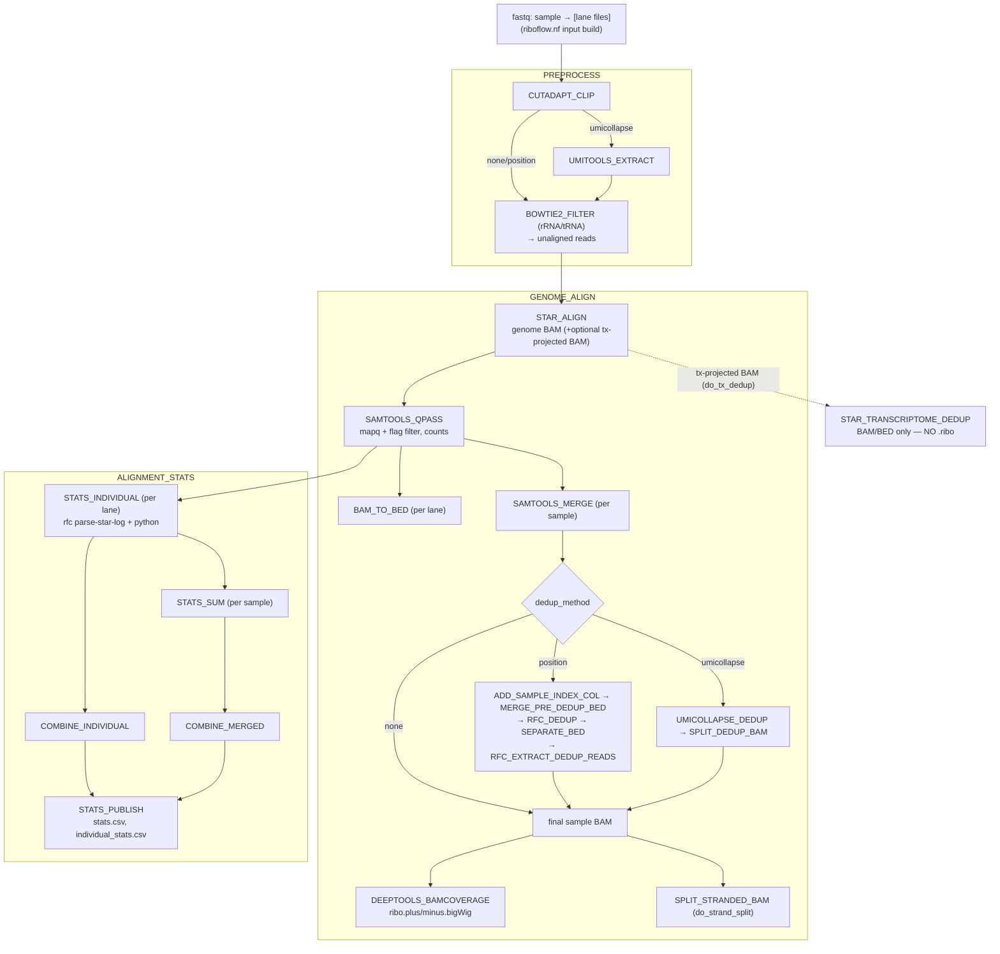

# Architecture (Phase 1 — genome path)

`main.nf` → `workflows/riboflow.nf` builds the per-lane input channel, runs file
existence checks, then calls the subworkflows below. Environment selection
(conda/docker/ambient) is profile-driven; per-module output locations and CLI
args come from `conf/modules.config`.

## Output layout (parity with DSL1)
- `output/alignments/ribo/{individual,merged}/` — post-dedup BAM/BED (or qpass when `none`)
- `output/alignments/ribo/stranded/` — stranded BAM/BED (when `do_strand_split`)
- `output/bigwigs/ribo/*.ribo.{plus,minus}.bigWig` (only when `do_bigwig`; default off)
- `output/stats/{stats.csv,individual_stats.csv,index_fastq_correspondence.txt}`
- `output/fastqc/...` (when `do_fastqc`)
- intermediates under `intermediates/` (incl. `transcriptome_alignment/` for the tx path)

## Storage notes
- Final BAM/BED (and the `.ribo` from `RIBOPY_RNASEQ_SET`) are cached in `intermediates/`
  via `storeDir` and exposed under `output/` via `publishDir mode: 'link'` — a **hard link**,
  so there is only **one physical copy** on disk (no duplication). This requires `output/` and
  `intermediates/` to live on the **same filesystem** (the default — they're siblings in the
  run dir). If you point their `base` paths at different mounts, switch those `publishDir`
  entries to `mode: 'symlink'` in `conf/modules.config`.
- bigWig generation (`DEEPTOOLS_BAMCOVERAGE`, genome ribo + rnaseq) is gated on `do_bigwig`
  (default `false`); set `do_bigwig: true` to produce them.

See `` for the process→module map and ``
for the meta map and channel shapes.
